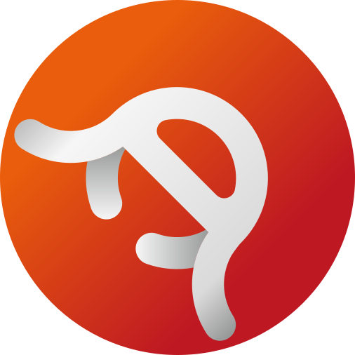

# Народный Банк Мемов

Проект экономической платформы для Мемного Мира, реализующий:
- Сам банк (кредитование и депозит)
- Валюты
- Торговую площадку, наподобие ТМЛ (Торговой Мемной Лиги)
- Акции
- Услуги и товары
- Инвентарь
- Крафт предметов

Для разработчиков:
- [Ядро](https://github.com/meme-bank/core) самого проекта является свободным ПО (лицензируется по AGPLv3), поэтому мы только рады, если вы поможете в разработке
- Также для разработчиков, желающих интгрировать наше решение в свои проекты, предоставляется API на GraphQL
- Есть набор React-компонентов от НБМ, которые вы можете где то использовать, - [Ядро](https://github.com/meme-bank/ui-kit)
- Исходный код веб-клиента также открыт

## Идея проекта
Изначальная идея этого проекта: создание альтернативы Торговой Мемной Лиге (тогда ещё Банк Кекляндии), однако потом она переросла в идю учёта ошибок ТМЛ. Какие же ошибки:
- Пароль не был захеширован
- Меня лично бесило то, что нельзя было связатьб то, что было на ТМЛ с тем, что было в боте, то есть отсутствие API
- Плохая адаптивность ТМЛ на телефонах (это самый настоящий монолит, где логика перемешана с самим дизайном, отчего исходит ещё одна ошибка)
- Плохая масштапбируемость

Именно эти проблемы пытается решить НБМ, и именно они сидят в основе идеи проекта НБМ:
- Безопасность
- Открытость
- Расширяемость

## !!!Предупреждение!!!
Клиенты, которые не опубликованы в официальных источниках, то есть GitHub аккаунт, наш сайт и другие ресурсы, на которые ссылаются в раннее преречисленных источниках - не являются официальными, использовать не рекомендуем, если вы не уверены в происхождении этих клиентов и добросовестности их авторов!
